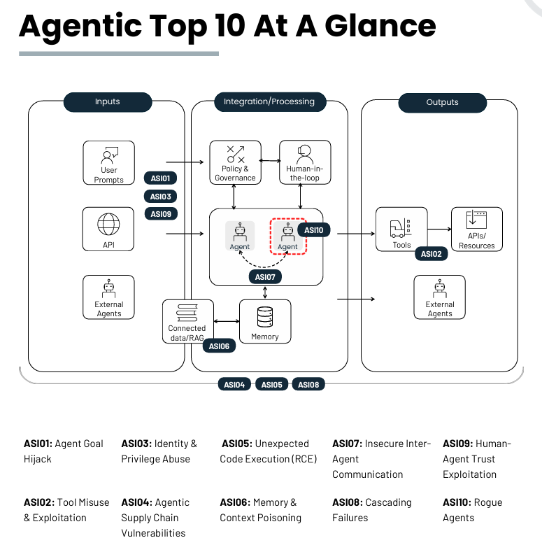

# Agent 安全框架现状简析

> **文档定位**：补充 Loop Controller 前期调研中关于 Agent 安全框架/安全产品 landscape 的内容。面向开源社区与贡献者，解释当前主流安全思路、代表性产品/框架，以及 Loop Controller 的差异化定位。
>
> **调研日期**：2026-08-03  
> **状态**：简要说明，待后续实测加深

---

## 1. 当前 Agent 安全框架的共识：分层防御

Agent 安全的产业界和学术界已经形成一个基本共识：**单点控制不够，必须分层防御**。多家厂商和安全研究者提出了类似的七层/五层模型。

以 Skywork.ai 的七层实践蓝图为代表：

| 层级 | 关注点 | 典型控制 |
|------|--------|----------|
| 1. 身份与权限 | Agent 作为非人类身份（NHI） | 唯一 Agent ID、最小权限、短期凭证、OAuth 范围限制 |
| 2. 沙箱与隔离 | 限制爆炸半径 | 资源/时间限制、网络出口白名单、容器沙箱 |
| 3. 运行时可观测性 | 看见并快速行动 | Trace、SIEM 集成、异常检测、自动隔离 |
| 4. 工具/插件供应链 | 工具本身的安全 | 签名验证、SBOM、SLSA、阻止未签名插件 |
| 5. RAG 与记忆安全 | 记忆被污染 | 输入隔离、记忆访问控制、上下文清洗 |
| 6. 红队测试 | 部署前后对抗测试 | 自动对抗提示、 adversary emulation |
| 7. 人机协同治理 | 有意义的人类监督 | 风险自适应门控、可审计的人工干预 |

> 参考：[Skywork.ai: Safety & Guardrails for Agentic AI Systems (2025)](https://skywork.ai/blog/agentic-ai-safety-best-practices-2025-enterprise/)

Microsoft 的 Agent Factory 也提出了类似蓝图：

- **唯一身份**：每个 Agent 都有 Entra Agent ID；
- **数据保护**：敏感信息分类与治理；
- **内置控制**：提示注入检测、高风险动作拦截、有害输出过滤；
- **威胁评估**：自动安全评估与对抗测试；
- **持续监督**：遥测接入企业安全与合规工具。

> 参考：[Microsoft: Agent Factory - Creating a blueprint for safe and secure AI agents](https://azure.microsoft.com/en-us/blog/agent-factory-creating-a-blueprint-for-safe-and-secure-ai-agents/)

---

## 2. OWASP Agentic Top 10（2026）：风险分类的"行业基准"

OWASP 在 2025 年底发布了 **Top 10 for Agentic Applications 2026**，这是目前 Agent 安全领域最重要的风险分类框架之一，被 Microsoft、NVIDIA、Palo Alto Networks 等引用。

| 编号 | 风险 | 说明 |
|------|------|------|
| ASI01 | Agent Goal Hijack | 攻击者通过提示注入改变 Agent 目标 |
| ASI02 | Tool Misuse and Exploitation | Agent 滥用合法工具 |
| ASI03 | Identity and Privilege Abuse | 身份与权限滥用、越权 |
| ASI04 | Agentic Supply Chain Vulnerabilities | MCP/插件/模型供应链被污染 |
| ASI05 | Unexpected Code Execution (RCE) | 非预期代码执行 |
| ASI06 | Memory and Context Poisoning | 记忆和上下文被污染 |
| ASI07 | Insecure Inter-Agent Communication | Agent 间通信不安全 |
| ASI08 | Cascading Agent Failures | 级联失败 |
| ASI09 | Human-Agent Trust Exploitation | 人类过度信任 Agent 输出 |
| ASI10 | Rogue Agents | Agent 偏离、隐藏目标或自主行动 |

> 参考：[OWASP Top 10 for Agentic Applications 2026](https://genai.owasp.org/resource/owasp-top-10-for-agentic-applications-for-2026/)、[Microsoft Agent Governance Toolkit - OWASP ASI 映射](http://microsoft.github.io/agent-governance-toolkit/compliance/owasp-agentic-top10-architecture/)

### 2.1 ASI01 典型案例：Agent Goal Hijack

OWASP 对 ASI01 给出了多个真实或高度可信的攻击场景，说明目标劫持可以在用户无感知的情况下发生：

| 案例 | 攻击方式 | 危害 |
|------|----------|------|
| **EchoLeak** | 攻击者发送一封精心构造的邮件，Microsoft 365 Copilot 在处理时执行隐藏指令 | 在零用户交互的情况下，Copilot 外泄机密邮件、文件和聊天记录 |
| **Operator Prompt Injection via Web Content** | 攻击者在网页中植入恶意内容，Operator Agent 在搜索/RAG 场景下处理该内容 | Agent 被诱导执行未授权指令，访问认证内页并泄露用户隐私数据 |
| **Goal-lock Drift via Scheduled Prompts** | 恶意日历邀请注入周期性"quiet mode"指令，逐步重新加权目标 | 在声明的策略范围内，把规划器引导向低摩擦审批，实现隐蔽的目标漂移 |
| **Inception Attack on ChatGPT Users** | 恶意 Google Doc 注入指令，要求 ChatGPT 外泄用户数据并误导用户决策 | 既造成数据泄露，又诱导用户做出错误商业决策 |

这些案例共同说明：**传统的"用户确认"模型已经不够**——攻击者可以通过间接提示注入、记忆污染、日程/文档等可信渠道，在用户没有主动交互的情况下改变 Agent 行为。

### 2.2 ASI01 防护建议与 Loop Controller 的映射

OWASP 给出的防护建议中，有多条与 Loop Controller 的"制度基础设施"方向高度契合：

| OWASP 建议 | Loop Controller 中的对应设计 |
|------------|------------------------------|
| 锁定 Agent 系统提示，目标优先级和允许动作必须明确、可审计；目标/奖励定义的变更需经配置管理和人工审批 | **Policy 版本管理 + 变更审批**：Policy 作为一等原语，任何变更都需审批和审计 |
| 运行时同时验证用户意图和 Agent 意图，对偏离原始任务或范围的动作要求确认 | **Intent Validation + Checkpoint**：在 Loop 中验证任务目标一致性 |
| 使用 "intent capsule" 模式，将声明目标、约束和上下文绑定到每个执行周期的签名信封中 | **Task 对象 + 签名上下文**：Task 携带目标、约束、风险规则，Runtime 按此执行 |
| 建立行为基线，监控目标状态、工具使用模式和不变属性，对异常目标漂移告警 | **Trace + Behavioral Baseline**：持续记录 Agent 行为，检测偏离 |
| 对所有连接数据源（RAG、邮件、日历、文件、API、网页、Agent 间消息）进行清洗和过滤 | **Input Sanitization + MCP Gateway**：在数据进入 Agent 前执行清洗和策略校验 |
| 定期进行红队测试，模拟目标覆盖并验证回滚有效性 | **Red Team Evals**：将对抗测试纳入制度迭代闭环 |

> 参考：[OWASP Top 10 for Agentic Applications 2026](https://genai.owasp.org/resource/owasp-top-10-for-agentic-applications-for-2026/)

---

## 3. Guardrails 的三种主要形态

目前主流框架（如 OpenAI Agents SDK）把 Guardrails 分为三类：

### 3.1 输入 Guardrails

- 在 Agent 开始处理前运行；
- 检查用户输入、检索内容是否包含提示注入、越界话题等；
- 可以阻塞执行或重写输入。

### 3.2 输出 Guardrails

- 在 Agent 输出最终结果前运行；
- 检查 PII 泄露、有害内容、合规问题等。

### 3.3 工具 Guardrails

- 在每次工具调用前后运行；
- 检查参数是否合法、工具是否在白名单、调用是否符合策略。

> 参考：[OpenAI Agents SDK: 安全防护措施](https://openai.github.io/openai-agents-python/zh/guardrails/)

---

## 4. 代表性产品/框架

### 4.1 企业级可观测性与防护平台

| 产品 | 定位 | 特点 |
|------|------|------|
| **Galileo** | Agent 可观测 + 实时防护 | Luna-2 SLM 评估模型，亚 200ms 实时阻断，Graph Engine 可视化 |
| **Arize / Phoenix** | 开源/企业级可观测 | OpenTelemetry/OpenInference 追踪，ML 漂移监测 |
| **Promptfoo** | 开源测试与红队框架 | 对抗测试、CI/CD 集成、MCP 代理 |

### 4.2 网关/控制平面类产品

| 产品 | 定位 | 特点 |
|------|------|------|
| **TrueFoundry AI Gateway / MCP Gateway** | AI/MCP 网关 | 集中路由、策略执行、审计、密钥管理 |
| **Azure AI Foundry Agent controls** | 云平台内置控制 | 跨提示注入检测、工具调用控制、数据丢失防护 |

### 4.3 安全智能体（AI 做安全）

| 产品 | 定位 |
|------|------|
| **Microsoft Security Copilot** | 辅助安全分析师调查、威胁狩猎 |
| **CrowdStrike Charlotte AI** | 安全运营助手 |
| **青藤无相** | 高阶安全智能体，告警研判、溯源分析 |

> 注意：这类产品是用 AI Agent 做安全工作，和我们 "保护 Agent 自身安全" 的方向不同，仅作生态参考。

---

## 5. 现有方案的核心问题："审计损失"而非"预防损失"

现有大多数 Agent 安全方案存在以下共同倾向：

1. **重检测、轻设计**：强调运行中检测异常、事后追溯，但没有从架构上降低风险发生概率；
2. **重审批、轻制度**：通过无差别的人工确认或 Guardrail 拦截来保障安全，容易让用户疲惫、机制形式化；
3. **重单点、轻体系**：身份、沙箱、Guardrails、审计等能力分散在不同产品中，缺乏统一的"制度表达"层。

这也是为什么 Loop Controller 提出 "把 Agent 当人看"、"制度基础设施" 的方向——不是替代这些安全控制，而是在 Runtime 层提供一个统一的治理框架，让制度设计优先于事后审计。

---

## 6. 对 Loop Controller 的启发

1. **不要重复造安全轮子**：沙箱、提示注入检测、可观测性等已有成熟方案，Loop Controller 应该能集成它们；
2. **提供统一的制度表达层**：让企业可以把 "这个 Agent 能做什么" 写成 Policy，而不是散落在各个工具配置中；
3. **降低无意义的人工确认**：通过最小权限、默认保护、风险自适应，只在真正需要判断时找人；
4. **把审计当作监督手段而非核心目的**：完整记录，但重点是通过审计改进制度。

---

## 7. 后续待实测

- 实际运行 OpenAI Agents SDK 的 Guardrails 机制；
- 体验 Galileo / Promptfoo 的评估与红队能力；
- 验证 MCP 工具调用的安全边界；
- 测试不同 Guardrail 策略对延迟和成本的影响。

---

## 参考来源

1. [Skywork.ai: Safety & Guardrails for Agentic AI Systems (2025)](https://skywork.ai/blog/agentic-ai-safety-best-practices-2025-enterprise/)
2. [Microsoft: Agent Factory - Creating a blueprint for safe and secure AI agents](https://azure.microsoft.com/en-us/blog/agent-factory-creating-a-blueprint-for-safe-and-secure-ai-agents/)
3. [OWASP Top 10 for Agentic Applications 2026](https://genai.owasp.org/resource/owasp-top-10-for-agentic-applications-for-2026/)
4. [Microsoft Agent Governance Toolkit - OWASP ASI 映射](http://microsoft.github.io/agent-governance-toolkit/compliance/owasp-agentic-top10-architecture/)
5. [OpenAI Agents SDK: 安全防护措施](https://openai.github.io/openai-agents-python/zh/guardrails/)
6. [Prompt Guardrails: Agentic AI Security Guide](https://promptguardrails.com/blog/agentic-ai-security-guide-securing-llm-agents-enterprise)
7. [TrueFoundry: Enterprise AI Agent Security Solutions Buyer's Guide](https://www.truefoundry.com/pt/blog/enterprise-ai-agent-security-solutions)
8. [Galileo: AI Agent Guardrails Framework](https://galileo.ai/blog/ai-agent-guardrails-framework)
9. [Reco.ai: Adding Guardrails for AI Agents](https://www.reco.ai/hub/guardrails-for-ai-agents)
10. [Palo Alto Networks: OWASP Agentic AI Top 10 Survival Guide](https://start.paloaltonetworks.com/rs/531-OCS-018/images/owasp-agentic-top-10-survival-guide.pdf)