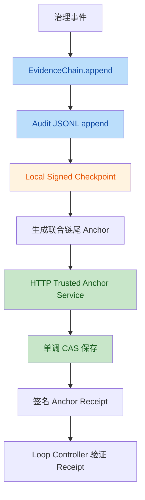
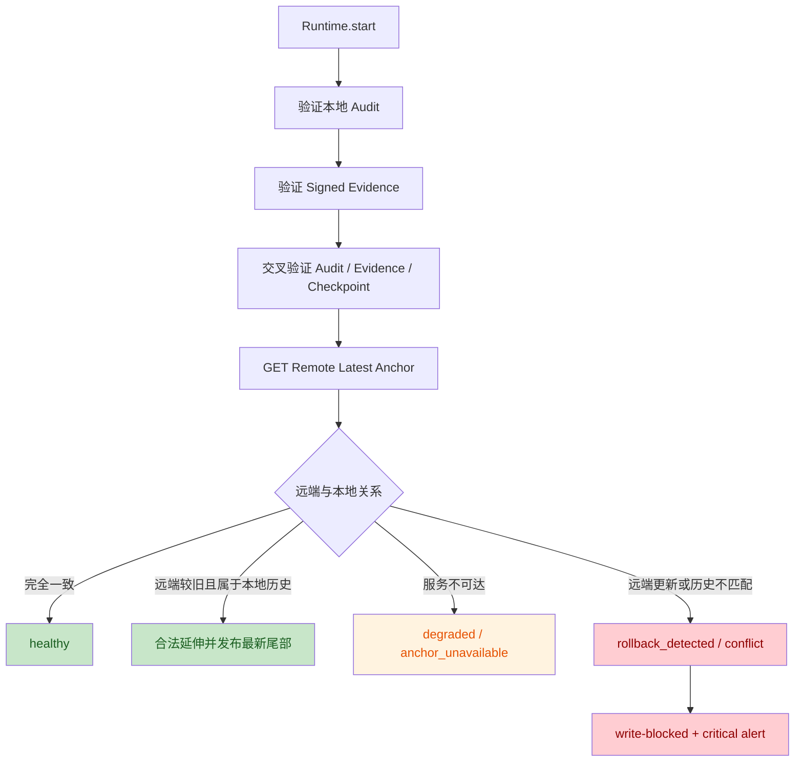

# v0.28.0 开发文档：外部可信证据锚点

## 1. 版本定位

v0.28.0 只解决一个明确的安全缺口：

> 将已经完成本地一致性提交的 Audit 与 Signed Evidence 联合链尾，发布到独立安全域中的外部可信服务；Runtime 启动时读取远端最新锚点并验证本地链，从而检测 Audit、Evidence 与本地 checkpoint 被同时删除、替换或整体回退。

当前本地证据体系已经具备：

- Audit JSONL 哈希/HMAC 链；
- Signed Evidence 签名链；
- Audit 与 Evidence 逐事件交叉验证；
- 本地签名 checkpoint；
- 单边写入失败后的 degraded/write-blocked 语义；
- 单进程内同步与异步审计的串行写入。

但三类状态都位于同一主机：

```text
Audit JSONL
Signed Evidence JSONL
Local Signed Checkpoint
```

如果攻击者把三者一起恢复到过去某个密码学有效的状态，本地验证仍会通过。v0.28.0 通过独立外部锚点记录“系统曾经到达的最新链位置”，补上这一信任边界。

---

## 2. 与前序版本的关系

```text
v0.25.0  Harness 执行出口
v0.26.0  全局吊销、Kill Switch、签名证据链
v0.26.1  吊销边界和本地证据一致性修复
v0.27.0  Harness 生产闭环
v0.27.1  Harness 协议与运行可靠性修复
v0.28.0  外部可信证据锚点
```

v0.28.0 不改变 Agent 接入、策略、审批和执行器架构，只扩展审计证据提交与启动验证链路。

---

## 3. 威胁模型

### 3.1 本版本必须检测

假设系统曾经到达：

```text
Audit tail      = seq 1000 / hash A1000
Evidence tail   = seq 1000 / hash E1000
Checkpoint      = seq 1000
Remote Anchor   = seq 1000 / A1000 / E1000
```

攻击者取得 Loop Controller 主机文件权限后，把全部本地状态恢复到历史备份：

```text
Audit tail      = seq 700 / hash A700
Evidence tail   = seq 700 / hash E700
Checkpoint      = seq 700
Remote Anchor   = seq 1000 / A1000 / E1000
```

Runtime 启动时必须识别：

```text
local seq 700 < remote seq 1000
→ rollback_detected
→ 阻断后续审计写入
→ 产生 critical alert
```

还必须检测：

- 本地与远端相同 seq、不同 hash；
- 远端旧锚点不属于当前本地历史链；
- receipt 签名无效或使用未知服务密钥；
- 外部服务返回违反单调性的状态；
- 配置指向了已有不兼容历史的 stream。

### 3.2 本版本不承诺防御

- 攻击者同时控制 Loop Controller 与外部 Anchor Service；
- 外部服务与本地主机处于相同权限和故障域；
- 最近一次成功锚定后的未锚定尾部一定可检测；
- 多进程或多 worker 共享同一 JSONL 文件安全写入；
- 本地签名私钥达到 KMS/HSM 的保护等级；
- 通过锚点恢复完整审计内容；
- 普通可覆盖数据库天然具有 WORM 合规能力。

外部锚点必须部署在独立主机、账户或管理域中，否则只能视为远程副本，不能宣称为可信锚点。

---

## 4. 总体架构



启动验证：



---

## 5. 设计原则

1. **Anchor 与 EvidenceBackend 分离**  
   `EvidenceBackend` 保存完整 `SignedEvidence`；Anchor 只保存联合链尾承诺，职责不同。

2. **只锚定已经完成的本地提交**  
   必须在 Evidence、Audit 和本地 checkpoint 全部成功后发布。

3. **远端状态只能单调前进**  
   客户端不能用旧状态覆盖新状态；服务端必须原子执行单调 CAS。

4. **可用性故障与完整性冲突分离**  
   网络不可达通常降级但保留本地审计；确定性回退或分叉必须阻断写入。

5. **不复制完整事件**  
   Anchor 不包含工具参数、Secret、用户 Prompt 或完整审计正文。

6. **客户端必须验证 Receipt**  
   仅收到 HTTP 200 不能构成可信锚点；必须验证外部服务签名。

7. **保持单一有序写者**  
   v0.28 不使用无序 `asyncio.create_task()` 发布锚点，也不引入多消费者队列。

---

## 6. 数据模型

建议新增：

```text
src/loop_controller/audit/anchors.py
src/loop_controller/audit/anchor_backends.py
```

### 6.1 AnchorPayload

```python
class AnchorPayload(BaseModel):
    model_config = ConfigDict(frozen=True)

    schema_version: Literal["1"] = "1"
    stream_id: str
    audit_seq: int
    audit_hash: str
    evidence_seq: int
    evidence_hash: str
    evidence_algorithm: str
    evidence_key_id: str
```

约束：

- `stream_id` 必须稳定、非空、全局唯一；
- `audit_seq == evidence_seq`；
- seq 必须大于等于 0；
- 非 genesis 状态的两个 hash 必须是 64 位十六进制摘要；
- 不允许额外字段静默进入 canonical payload；
- Payload 不包含客户端生成时间，确保相同链尾在进程重启后仍生成相同幂等键；时间证明由 Receipt 的 `anchored_at` 提供。

推荐 stream 格式：

```text
<deployment_id>/<logical_stream>
```

v0.28 最小范围只支持：

```text
deployment-01/default
```

不把当前预留的 `tenant_id` 扩展成完整多租户安全模型。

### 6.2 AnchorReceipt

```python
class AnchorReceipt(BaseModel):
    model_config = ConfigDict(frozen=True)

    receipt_id: str
    payload: AnchorPayload
    anchored_at: datetime
    service_key_id: str
    algorithm: Literal["ed25519"]
    signature: str
```

签名载荷：

```python
canonical_json({
    "receipt_id": receipt_id,
    "payload": payload.model_dump(mode="json"),
    "anchored_at": anchored_at,
    "service_key_id": service_key_id,
    "algorithm": algorithm,
})
```

`anchored_at` 是规范化字符串：UTC RFC3339、固定 6 位微秒、以 `Z` 结尾，例如 `2026-08-28T12:00:01.000000Z`。服务端签名前完成规范化，客户端拒绝 naive、非 UTC 或非规范格式，不允许在验签时自行改写。

第一版只要求 Ed25519 receipt，避免把远端可信性退化为共享 HMAC 密钥。客户端只配置公钥，不能伪造服务端 receipt。

### 6.3 幂等键

```python
idempotency_key = sha256(canonical_json(payload))
```

相同 payload 在进程重启后仍必须生成相同幂等键并返回同一 receipt；相同 seq 但 hash 不同必须返回冲突。客户端不得把当前时间或随机数放入 Payload。

---

## 7. 后端抽象

```python
class EvidenceAnchorBackend(Protocol):
    def publish(
        self,
        payload: AnchorPayload,
        *,
        idempotency_key: str,
    ) -> AnchorReceipt: ...

    def latest(self, stream_id: str) -> AnchorReceipt | None: ...

    def close(self) -> None: ...
```

本版本采用同步接口，因为现有 `JsonlAuditStore.append_async()` 已将完整写路径放在专用 `audit-writer` 线程中。这样可以：

- 保持单一提交顺序；
- 不阻塞 asyncio 事件循环；
- 避免跨事件循环锁；
- 不引入后台任务丢失问题；
- 让 checkpoint 与 anchor 使用同一不可变尾状态快照。

必须配置较短的网络超时，防止 audit-writer 长时间阻塞。

---

## 8. HTTP Anchor Backend

v0.28 只实现一个远程后端：

```text
HTTPAnchorBackend
```

### 8.1 API 契约

发布：

```http
PUT /v1/anchors/{stream_key}
Content-Type: application/json
Accept: application/json
Idempotency-Key: <sha256>
Authorization: Bearer <token>
```

获取最新状态：

```http
GET /v1/anchors/{stream_id}/latest
Authorization: Bearer <token>
```

`stream_id` 放入路径时必须按单个 path segment 进行 URL 编码；服务端解码后必须与 Payload 中的 `stream_id` 完全一致。

推荐响应：

```json
{
  "receipt_id": "rcpt_...",
  "payload": {
    "schema_version": "1",
    "stream_id": "deployment-01/default",
    "audit_seq": 120,
    "audit_hash": "...",
    "evidence_seq": 120,
    "evidence_hash": "...",
    "evidence_algorithm": "ed25519",
    "evidence_key_id": "evidence-2026-01"
  },
  "anchored_at": "2026-08-28T12:00:01.000000Z",
  "service_key_id": "anchor-service-01",
  "algorithm": "ed25519",
  "signature": "base64..."
}
```

### 8.2 服务端单调规则

服务端必须在单个事务/CAS 中执行：

| 已存状态 | 新请求 | 行为 |
|---|---|---|
| 无记录 | 合法 payload | 接受并签发 receipt |
| 同 seq、完整 canonical payload 字节相同 | 相同请求重试 | 幂等返回原持久化 receipt |
| 同 seq、任一 payload 字段不同 | 分叉 | `409 anchor_conflict` |
| 新 seq 小于已存 seq | 回退 | `409 anchor_rollback_rejected` |
| 新 seq 大于已存 seq | 前进 | 原子更新并签发 receipt |

服务端不能采用“GET 后由客户端比较，再无条件 PUT 覆盖”的实现。服务端还必须验证 `Idempotency-Key == sha256(canonical_json(payload))`；同一幂等键绑定不同 payload 时拒绝。幂等判断基于完整 canonical payload，不得只比较 seq 或 hash 子集。

### 8.3 传输和认证

生产配置必须：

- 使用 HTTPS；
- 校验服务端证书；
- 支持企业 CA；
- Bearer token 从环境变量或 Secret Broker 获取；
- 可选 mTLS；
- 日志不得记录 token、Authorization header、完整 receipt signature；
- TLS/HTTP 原始响应正文不得直接写入告警。

外部服务签名公钥和 HTTP 认证是两个独立概念：

```text
HTTPS / API token：认证网络请求
Receipt Ed25519：证明远端确实接受过该锚点
```

---

## 9. 写入集成

### 9.1 顺序

`JsonlAuditStore` 写入顺序扩展为：

```text
1. EvidenceChain.append
2. Audit JSONL append
3. Local Signed Checkpoint
4. Build AnchorPayload from the committed snapshot
5. HTTPAnchorBackend.publish
6. Verify AnchorReceipt
7. Update in-memory anchor health
```

必须满足：

- Evidence 失败时不发布，并在保留本次 Audit 后立即阻断后续写入；由于本版本没有 outbox/补写协议，不能继续扩大 Audit/Evidence 序号差；
- Audit 失败时不发布；
- checkpoint 失败时不发布；
- Evidence 已处于 degraded 时不发布“看似健康”的新锚点；
- payload 的 seq/hash 必须与刚写入 checkpoint 完全一致；
- receipt 验证成功后才更新 `last_success_seq`。

### 9.2 提交矩阵

| Evidence | Audit | Checkpoint | Anchor | 结果 |
|---|---|---|---|---|
| 失败 | 成功 | 不推进 | 不调用 | Audit 保留，立即 write-blocked，等待显式一致性恢复 |
| 成功 | 失败 | 不调用 | 不调用 | 阻断后续写入 |
| 成功 | 成功 | 失败 | 不调用 | 本地已提交，Evidence/Anchor degraded |
| 成功 | 成功 | 成功 | 网络失败 | 本地提交成功，Anchor degraded |
| 成功 | 成功 | 成功 | 确定性冲突 | 当前本地提交保留，后续写入阻断 |
| 成功 | 成功 | 成功 | 成功 | healthy |

Anchor 是本地提交后的附加安全承诺，不能因为暂时网络故障把已经发生的工具执行结果改写为失败。

### 9.3 发布频率

v0.28.0 固定每个完整本地提交都发布，不开放批量频率配置：

```yaml
every_n_events: 1
```

因此每次普通审计和 `seal()` 都走同一提交路径，不增加 seal 特例。

本版本不实现持久化 outbox；锚定失败后，下一次本地成功提交尝试发布最新尾部。最新链尾会密码学承诺此前完整前缀，无需补发每个中间 seq。不得在锁外读取链尾后异步发布，否则可能把错误 seq/hash 组合写入远端。

---

## 10. 启动验证

Runtime 启动顺序调整为：

```text
1. verify local Audit chain
2. verify Signed Evidence chain
3. cross-check Audit / Evidence / local checkpoint
4. GET remote latest anchor
5. verify receipt signature
6. compare remote anchor with local current/history state
7. decide anchor status and write gate
8. 启动只读 health 与受限 Admin 恢复面
9. 仅在允许写入的状态下启动 MCP、业务 HTTP、Harness、HotReloader 等执行面
```

### 10.1 外部与本地均为空

视为新部署：

```text
anchor_status = healthy
```

第一条完整提交后建立首个锚点。

### 10.2 外部为空、本地非空

不能静默建立新锚点。可能是升级、错误 stream 或远端数据丢失。

默认行为：

```text
anchor_status = bootstrap_required
允许 Runtime 启动
允许读取和健康查询
阻断新的审计写入
```

只有显式执行管理员 bootstrap，且本地 Audit/Evidence/checkpoint 完整验证通过，才允许建立第一个远端锚点。

不要使用长期配置项自动反复 bootstrap；必须提供一个窄化的 bootstrap 事务：在 AuditStore 独占写锁内，只允许固定类型的 `anchor_bootstrap` 管理事件越过 anchor gate，先完成 Evidence → Audit → checkpoint，再将包含该事件的最新尾部建立为首个远端锚点。发布失败时保留该尝试事件并继续保持 `bootstrap_required`；不得提供通用 gate bypass。

### 10.3 外部 seq 大于本地 seq

```text
rollback_detected
write-blocked
critical alert
```

不允许自动覆盖远端、重置 stream 或把本地视为新部署。

### 10.4 外部 seq 等于本地 seq

必须同时匹配：

- audit_hash；
- evidence_hash；
- evidence_algorithm；
- evidence_key_id；
- stream_id。

任意不一致：

```text
anchor_conflict
write-blocked
```

### 10.5 外部 seq 小于本地 seq

必须验证远端锚点属于本地历史：

```python
local_audit_hash_at(remote.audit_seq) == remote.audit_hash
local_evidence_hash_at(remote.evidence_seq) == remote.evidence_hash
```

匹配：本地是合法延伸，允许启动并发布最新尾部。

不匹配：历史分叉，进入 `anchor_conflict` 并阻断写入。

---

## 11. 状态与失败语义

新增独立状态，不覆盖现有 `evidence_status`：

```text
anchor_status =
  disabled
  healthy
  degraded
  anchor_unavailable
  bootstrap_required
  rollback_detected
  anchor_conflict
```

| 状态 | 含义 | 是否允许继续审计写入 |
|---|---|---|
| `disabled` | 未配置锚点 | 是 |
| `healthy` | 最近验证或发布成功 | 是 |
| `degraded` | 发布失败但未确认冲突 | 是 |
| `anchor_unavailable` | 启动时远端暂不可达 | 由配置决定，默认是 |
| `bootstrap_required` | 本地有历史但远端无记录 | 否 |
| `rollback_detected` | 远端 seq 高于本地 | 否 |
| `anchor_conflict` | 同 seq 异 hash、历史分叉或 receipt 无效 | 否 |

启动面约束：

- `healthy`：开放完整运行面；
- `degraded`、允许继续的 `anchor_unavailable`：开放完整运行面但持续告警；
- `bootstrap_required`：仅开放 health、只读状态、verify 和 bootstrap；
- `rollback_detected`、`anchor_conflict`：仅开放只读 health/诊断，不允许 bootstrap、publish 或工具执行；
- 业务 HTTP/MCP、Harness、HotReloader 等执行面不得在阻断状态下提前启动。

### 11.1 暂时可用性失败

包括：

- DNS/连接失败；
- connect/read timeout；
- HTTP 429；
- HTTP 5xx；
- Anchor Service 暂时不可达。

行为：

- 本地 Audit/Evidence/checkpoint 保留；
- 不向业务调用方伪装成工具执行失败；
- `anchor_status=degraded` 或 `anchor_unavailable`；
- 产生稳定告警；
- 后续提交尝试发布最新链尾；
- 不在请求内无限重试。

### 11.2 请求结果不确定

PUT 超时可能是“服务端已保存但响应丢失”。处理顺序：

1. 使用稳定 Idempotency-Key；
2. GET latest；
3. latest 等于待发布状态时视为成功；
4. latest 较旧时用相同幂等键重试；
5. latest 同 seq 异 hash或出现不兼容状态时进入 conflict。

### 11.3 确定性完整性冲突

以下情况必须阻断：

- 远端 seq 高于本地；
- 同 seq 异 hash；
- 远端历史锚点不属于本地链；
- receipt 签名无效；
- service_key_id 未知；
- stream_id 不一致；
- Anchor Service 返回违反单调性的 receipt。

不自动修复、不自动切换 stream、不自动覆盖远端。

---

## 12. 并发和生命周期

### 12.1 单进程写入

复用现有：

```text
ThreadPoolExecutor(max_workers=1)
+ JsonlAuditStore._sync_lock
```

锚点发布在相同串行提交路径中执行，不得使用无序后台任务：

```python
asyncio.create_task(anchor.publish(snapshot))  # 禁止
```

原因：

- 可能先发布 seq 102 再发布 seq 101；
- Runtime 关闭时任务可能丢失；
- 异常容易无人处理；
- anchor_status 会产生竞态；
- checkpoint 与 Anchor 可能不对应同一尾状态。

### 12.2 超时和背压

同步 HTTP 请求运行在 audit-writer 专用线程中，不阻塞 asyncio event loop，但会阻塞后续审计追加。因此必须配置：

```yaml
connect_timeout_seconds: 1.0
request_timeout_seconds: 3.0
```

超时必须有合理上限，禁止无限等待。

### 12.3 多进程边界

v0.28 仍只支持：

```text
一个 stream_id
一组 Audit/Evidence 文件
一个写 Runtime 实例
```

外部 CAS 可以检测分叉，但不能使本地 JSONL 获得跨进程安全性。

建议 P1 增加本地进程锁，防止同一数据目录误启动多个写实例；完整 active-active 留给后续分布式 Store 版本。

---

## 13. 配置设计

扩展 `config/evidence.yaml`：

```yaml
evidence:
  enabled: true
  backend: local

  local:
    path: evidence/
    checkpoint_path: evidence/checkpoint.json
    max_file_size_mb: 10

  signing:
    algorithm: ed25519
    key_id: evidence-2026-01
    private_key_env: LOOP_CONTROLLER_EVIDENCE_PRIVATE_KEY

  anchor:
    enabled: true
    type: http
    stream_id: deployment-01/default
    base_url: https://anchor.internal.example
    connect_timeout_seconds: 1.0
    request_timeout_seconds: 3.0
    every_n_events: 1

    auth:
      type: bearer
      token_env: LOOP_CONTROLLER_ANCHOR_TOKEN

    tls:
      verify: true
      ca_file: /etc/loop-controller/anchor-ca.pem
      client_cert_file: null
      client_key_file: null

    receipt:
      algorithm: ed25519
      service_key_id: anchor-service-01
      public_key_file: /etc/loop-controller/anchor-service.pub

    startup:
      unavailable_policy: degrade
      conflict_policy: block_writes
```

### 13.1 启动期配置校验

必须校验：

1. `anchor.enabled=true` 时 `evidence.enabled=true`；
2. `type` 第一版只能是 `http`；
3. `stream_id` 非空且不包含路径穿越字符；
4. 生产 URL 必须是 HTTPS；
5. URL 不允许 userinfo、query 和 fragment；
6. timeout 为正且有合理上限；
7. `every_n_events` 必须严格等于 1；
8. token 环境变量存在且非空；
9. CA、客户端证书和私钥文件存在且可读；
10. receipt 算法只能是 Ed25519；
11. service key ID 非空；
12. receipt 公钥存在且可解析；
13. 不支持的配置在 Runtime 构建前失败；
14. Secret、token 和完整底层异常不得进入错误消息。

---

## 14. Admin 与健康接口

### 14.1 健康信息

HTTP/gRPC health 增加：

```json
{
  "evidence_status": "healthy",
  "anchor_status": "healthy",
  "anchor_stream_id": "deployment-01/default",
  "anchor_last_success_seq": 120,
  "anchor_lag_events": 0,
  "anchor_last_error_code": null
}
```

不得返回：

- token；
- Authorization header；
- 私钥或公钥完整内容；
- 完整 receipt signature；
- 原始远程响应正文。

### 14.2 管理操作

新增受现有 Admin 认证和授权保护的操作：

```text
GET  /v1/admin/evidence/anchor
POST /v1/admin/evidence/anchor/verify
POST /v1/admin/evidence/anchor/publish
POST /v1/admin/evidence/anchor/bootstrap
```

要求：

- `GET` 返回净化后的摘要；
- `verify` 重新执行远端与本地比较；
- `publish` 只发布当前完整一致的本地尾部；
- `bootstrap` 只在远端无记录且本地全量验证通过时允许；
- bootstrap 必须显式确认并写入 admin audit；
- 冲突状态不能通过普通 publish 覆盖；
- 不提供“清空远端锚点”接口。

---

## 15. 告警与指标

### 15.1 稳定告警 Rule ID

```text
trusted_anchor_publish_failed
trusted_anchor_unavailable
trusted_anchor_verification_failed
trusted_anchor_receipt_invalid
trusted_anchor_bootstrap_required
trusted_anchor_rollback_detected
trusted_anchor_conflict
```

告警只保存：

- 稳定错误码；
- 异常类型；
- stream_id；
- 本地和远端 seq；
- 截断后的 hash 前缀（可选）；
- trace/event ID。

### 15.2 Prometheus 指标

```text
loop_controller_anchor_publish_total{status,error_code}
loop_controller_anchor_publish_duration_seconds
loop_controller_anchor_last_success_seq
loop_controller_anchor_lag_events
loop_controller_anchor_status
loop_controller_anchor_conflicts_total
```

限制 label 基数，不把 receipt_id、hash、trace_id 或异常文本作为 label。

---

## 16. 参考 Anchor Service

为了完成端到端协议验证，可以在测试中提供 HTTP Anchor 契约 backend 与故障注入 fixture。生产 Anchor Service 是独立部署边界，不要求在 v0.28 仓库内交付第二个生产服务。

若额外提供 `examples/contrib/anchor/` 示例，它只能标记为非生产参考实现，并且必须：

- 验证认证；
- 校验 AnchorPayload；
- 原子执行单调 CAS；
- 支持幂等键；
- 使用 Ed25519 签发 receipt；
- 持久化 latest receipt；
- 重启后不回退；
- 返回稳定错误码；
- 不允许无条件覆盖或删除 stream；
- 限制请求体大小；
- 不记录认证 Secret。

参考服务可以使用 SQLite 完成单事务 CAS。内存实现只能用于单元测试，不能作为生产示例默认后端。

---

## 17. 测试计划

### 17.1 模型和密码学

- canonical payload 字段顺序稳定；
- 相同链尾在进程重启后生成相同幂等键；
- `anchored_at` 必须符合固定 UTC RFC3339 字符串格式，naive 或非规范表示拒绝；
- 修改 stream、seq、hash、algorithm、key_id 后 receipt 验证失败；
- Base64 严格解码；
- 未知 schema version 拒绝；
- 未知 service key ID 拒绝；
- 非固定 UTC RFC3339 格式的 `anchored_at` 一律拒绝；
- 错误信息不泄露 token、完整签名或原始响应。

### 17.2 单调性和幂等

- 首次 publish 成功；
- 同 payload + 同幂等键返回同一 receipt；
- 同 seq 异 hash 返回 conflict；
- 较小 seq 被拒绝；
- 较大 seq 原子前进；
- 两个并发请求竞争时只产生合法单调结果；
- 服务重启后 latest 不回退。

### 17.3 写入顺序

验证：

```text
Evidence → Audit → Checkpoint → Anchor
```

覆盖：

- Evidence 失败不调用 Anchor；
- Audit 失败不调用 Anchor；
- checkpoint 失败不调用 Anchor；
- Anchor 失败时本地三份状态已存在；
- Anchor payload 与 checkpoint 完全相同；
- seal 与普通事件一样，每次完整提交只发布一次；
- 配置拒绝 `every_n_events != 1`，每次完整提交都只产生一次单调 publish。

### 17.4 启动恢复和整体回退

必须覆盖：

1. 本地和远端均为空；
2. 本地非空、远端为空，进入 bootstrap_required；
3. 显式 bootstrap 成功；
4. 删除全部本地 Audit/Evidence/checkpoint 后重启；
5. 删除完整本地尾部后重启；
6. 用密码学有效但较短的历史链替换当前链；
7. 本地与远端同 seq 异 hash；
8. 远端较旧且匹配本地历史；
9. 远端较旧但不属于本地历史；
10. 本地 checkpoint 落后但历史正确；
11. 配置指向错误 stream；
12. receipt 签名被篡改。

### 17.5 网络故障和不确定结果

- connect timeout；
- read timeout；
- HTTP 429；
- HTTP 500；
- TLS 验证失败；
- 401/403；
- 服务端已提交但响应丢失；
- GET latest 消解超时结果；
- 相同幂等键重试不产生新状态；
- 网络恢复后发布最新链尾；
- 网络故障不改变原工具执行结果。

### 17.6 并发

- `asyncio.gather()` 并发写入至少 50 条；
- Audit/Evidence seq 连续；
- Anchor 请求 seq 单调；
- 最终 receipt 指向最新 seq；
- 同步与异步混合追加不分叉；
- 慢 Anchor 不阻塞 asyncio heartbeat；
- Runtime 关闭后无遗留后台任务；
- 单线程 audit-writer 的背压可观察。

### 17.7 Admin、健康和告警

- 未配置时 `disabled`；
- 正常时 `healthy`；
- 网络失败时 `degraded`/`anchor_unavailable`；
- 回退时 `rollback_detected` 并阻断；
- 分叉时 `anchor_conflict` 并阻断；
- HTTP/gRPC 状态一致；
- bootstrap、verify、publish 都要求管理员授权；
- 所有管理操作有审计；
- 告警不泄露敏感信息。

### 17.8 配置负向测试

- Anchor 开启但 Evidence 关闭；
- 空或非法 stream ID；
- 非 HTTPS 生产 URL；
- URL 包含 userinfo/query/fragment；
- token 环境变量缺失；
- receipt 公钥缺失或无效；
- timeout 非正数或超过上限；
- `every_n_events=0`；
- 不支持的 backend/auth/receipt 算法；
- 配置错误必须 fail-fast。

---

## 18. 推荐实施顺序

1. `AnchorPayload`、`AnchorReceipt`、canonical 签名与验证；
2. `EvidenceAnchorBackend` 协议；
3. `HTTPAnchorBackend` 和错误模型；
4. ConfigLoader 校验和 Runtime 构造；
5. AuditStore checkpoint 后发布集成；
6. 启动期远端 latest 交叉验证；
7. 状态、write gate、告警和指标；
8. HTTP/gRPC Admin 接口；
9. SQLite 参考 Anchor Service；
10. 完整故障、并发和整体回退测试；
11. 全量 pytest、ruff、mypy。

每一步只建立完成当前闭环所需的最小抽象，不提前实现云厂商后端或分布式日志系统。

---

## 19. 验收标准

### P0 必须完成

- [ ] Anchor 使用独立接口，不与 `EvidenceBackend` 混用；
- [ ] Anchor 同时覆盖 Audit 和 Evidence 链尾；
- [ ] 只在本地 checkpoint 成功后发布；
- [ ] HTTP Anchor 契约测试覆盖原子单调 CAS、持久化 latest receipt 与重启不回退；
- [ ] 幂等重试不会产生冲突记录；
- [ ] 客户端验证 Ed25519 receipt；
- [ ] 启动时读取远端 latest 并校验本地当前/历史状态；
- [ ] 删除全部本地状态后能够检测整体回退；
- [ ] 网络故障不丢失本地审计；
- [ ] 确定性冲突阻断后续审计写入；
- [ ] bootstrap 必须显式执行并审计；
- [ ] 同进程并发写入顺序保持一致；
- [ ] HTTP/gRPC health 暴露 anchor_status；
- [ ] 告警、日志和错误响应不泄露 Secret；
- [ ] 明确不支持多进程共享 JSONL；
- [ ] 全量测试、ruff、mypy 通过。

### P1 推荐完成

- [ ] Admin verify/publish；
- [ ] Prometheus 指标；
- [ ] 本地进程锁防误启动多个写实例。

批量锚定与持久化 outbox 不属于 v0.28.0；如未来需要降低逐事件远程开销，应作为独立版本设计。

---

## 20. 明确不做

v0.28.0 不实现：

- S3、GCS、Azure Blob 多云后端；
- 完整远程 Audit/Evidence 仓库；
- WORM 全量归档和保留策略；
- KMS/HSM signer；
- 自动密钥轮换；
- 完整多租户隔离；
- 分布式序号、租约或多副本 Store；
- active-active Runtime；
- 持久化 Anchor outbox；
- Kubernetes Operator；
- UI 控制台；
- 新的工具执行器或 Harness 编排能力。

这些能力应拆分到后续独立版本，避免 v0.28 再次膨胀为云存储、密钥管理和分布式控制平面的合集。

---

## 21. 完成后的能力边界

v0.28.0 完成后，可以准确描述为：

> Loop Controller 将本地 Audit 与 Signed Evidence 的联合链尾发布到独立外部可信锚点，并在启动时验证单调性、receipt 签名及本地历史一致性，可以检测 Audit、Evidence 和 checkpoint 被同时删除或整体回退的场景。网络故障优先保留本地审计，确定性分叉则阻断后续写入。

仍不能描述为：

- 已拥有完整远程审计仓库；
- 已支持 active-active 或多 worker；
- 所有未获得 receipt 的尾部都具备外部不可回退证明；
- 任意普通 HTTP 服务都等同可信/WORM 存储；
- 本地签名密钥已经受到 KMS/HSM 保护；
- 外部锚点可以替代凭证隔离、网络出口控制或受控 Agent 运行环境。
